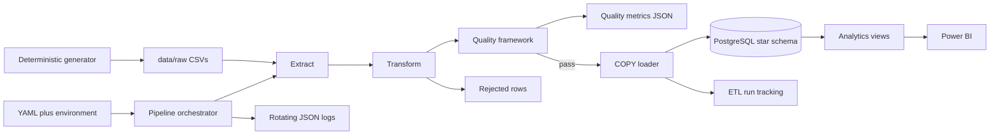

# Architecture

## Why each component exists

- YAML provides readable defaults; environment variables keep deployments flexible.
- A separate quality layer prevents publishing an untrustworthy batch.
- COPY minimizes Python-to-database overhead compared with individual inserts.
- One transaction prevents users from seeing a partially loaded warehouse.
- Run IDs make logs, metrics and database history traceable as one execution.
- Database constraints and indexes protect correctness and support analytical joins.

The `--skip-load` path preserves extraction, transformation and quality behavior for learners who do not yet have PostgreSQL running.

Snowflake is an optional adapter after the same quality gate. See [Snowflake architecture](snowflake_architecture.md) for the two-mode design.

