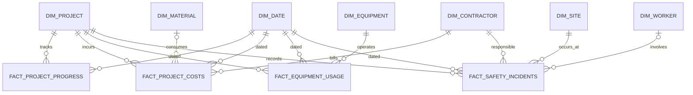

# Data model

## Fact grain

| Fact table | Grain |
|---|---|
| `fact_project_progress` | One project per report date |
| `fact_project_costs` | One project cost transaction/category per date |
| `fact_equipment_usage` | One equipment item on one project per date |
| `fact_safety_incidents` | One reported safety incident |

