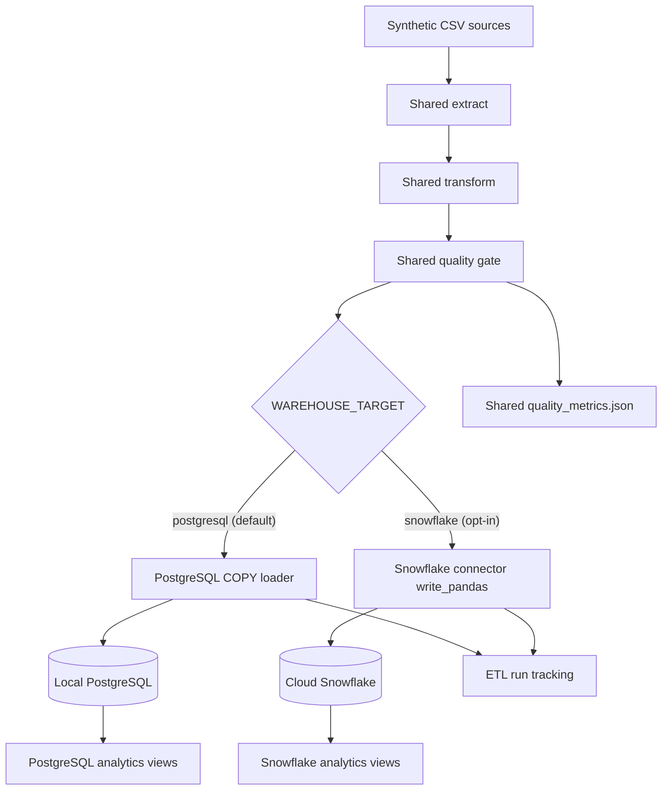

# PostgreSQL and Snowflake architecture

PostgreSQL is the primary local implementation. Snowflake is an explicit cloud option that reuses the tested ETL core.

## Why two SQL directories?

PostgreSQL and Snowflake are both SQL warehouses, but they differ in types, constraints, bulk-loading APIs and functions. Keeping `sql/01_schema.sql` and `sql/02_views.sql` for PostgreSQL while placing Snowflake scripts in `sql/snowflake/` makes those differences visible and interview-friendly.

Examples:

- PostgreSQL uses enforced foreign keys, check constraints, indexes and `COPY FROM STDIN`.
- Snowflake uses columnar storage, informational constraints, connector-managed staged loads and does not use PostgreSQL indexes.
- The Snowflake safety view uses `QUALIFY ROW_NUMBER()` and `COUNT_IF`; PostgreSQL uses `DISTINCT ON` and filtered aggregates.

## Cloud setup responsibilities

The project expects an existing Snowflake account, database and virtual warehouse. A Snowflake administrator should grant the ETL role only the privileges it needs:

- usage on the selected warehouse and database;
- create schema when the schema does not exist;
- usage and object-creation privileges on the target schema;
- select, insert, truncate and update privileges for repeated loads.

Exact grant commands depend on the account's ownership model. Do not use an administrator role as a long-term ETL credential.

## GitHub-safe operation

- Snowflake variables are blank or harmless placeholders in `.env.example`.
- The connector is optional and no Snowflake call occurs in PostgreSQL or `--skip-load` mode.
- Passwords are excluded from logs, quality metrics and ETL configuration snapshots.
- All uploaded rows come from the deterministic synthetic generator.
- Cloud integration is not run in public CI because it would require secrets and consume credits.

## Interview explanation

“I kept PostgreSQL as the default because reviewers can run it locally for free. I added Snowflake behind a loader interface to show cloud-warehouse awareness without coupling business transformations to one platform. Both targets receive the same quality-approved DataFrames, while each loader owns its connection, bulk-load strategy, run tracking and SQL dialect.”

